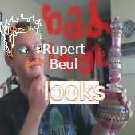

# Bad Book
# Corner 
## pdf ##
1. [Bad Looks ch 1-7](beuel/Bad-Looks-1-25.pdf)
2. [Bad Looks ch 8-15](beuel/Bad-Looks-26-46.pdf)
## epub ##
1. [Bad Looks ch 1-7](beuel/Bad Looks : Part 1 Looks.epub)
2. [Bad Looks ch 8-14](beuel/Bad Looks 8-14.epub)
## this and that ##
- [Chapter by Chapter Synopsis](beuel/Bad Looks CxC Syn.pdf)
- [Covering Letter](beuel/Cover Letter.pdf)  
***
# Follow me #
- 
> Preview of The Treaty of Life[^1] 
> 
>  [^1]: _Needs must manifest to make no difference whether you act in your own-self interest or for the greater good, nor if you want to secure a better future for your family or help whomsoever you-so choose. Whether to live with the lightest footprint or exist as a corporation or an nation, The Treaty of Life supposes nothing niether economic nor political. It mentions neither money nor law. The Treaty of Life is a restriction of practices or discourses for a greater share of clout. It offers an austere identifying mark, which carries the weight of a necktie with the reverence of the hindu third eye. Like the crossing gesture across the chest but as subtle as a wink. A test transmission of radio or a firework, to mark noon, or best, a drink served with salt. At heart, it's is a discussion on how to thrive with less, an identifiant source of green energy.
Admirants have claimed the comfort of socks. That which unites through a recripocal philisophy, an engine of work, collectively and to fulfill its goals and good aims. The Treaty of Life will forever be unfinished and the last pages invite you to continue writing. Conceptually it's a book that's a meter of interpretation, a plan written between an individual and one small collective.
	To do something for a vision to unite our worldiews with you lives draws a line into the future. And from that line, we have the ability to benefit others. -_-
